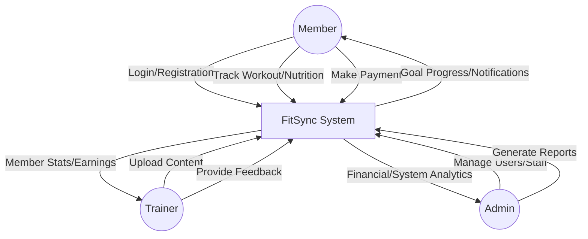
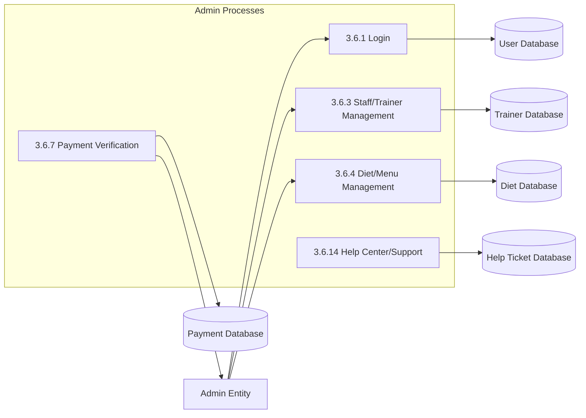
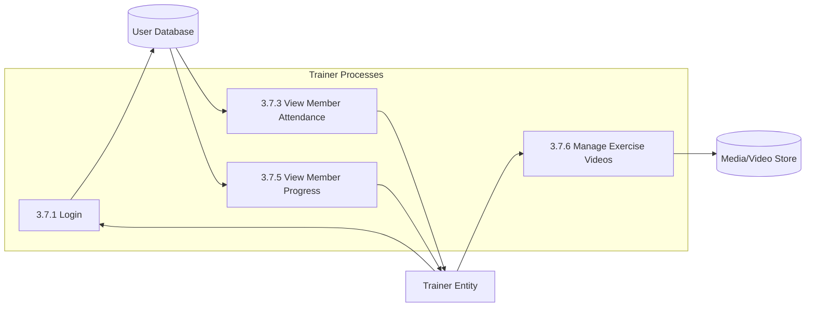
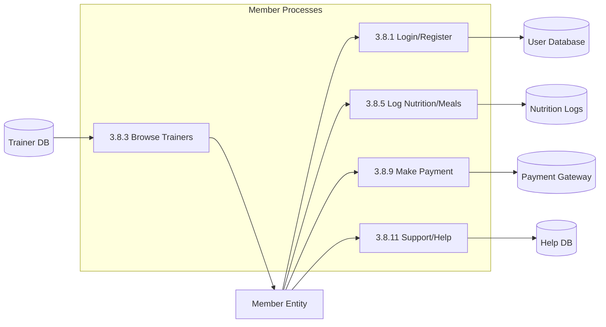

# FitSync Data Flow Diagrams (DFDs)

This document contains the visual blueprints for the **FitSync** system, mapped to the sections in Chapter 3.

## 3.2 Context Flow Design (Level 0 DFD)
The high-level interaction between the system and its users.

---

## 3.6 DFD for Admin (Level 1)
Detailed data flows for administrative processes (Mapping to 3.6.1 - 3.6.16).

---

## 3.7 DFD for Trainer / Staff (Level 1)
Detailed data flows for Trainer activities (Mapping to 3.7.1 - 3.7.6).

---

## 3.8 DFD for Member / User (Level 1)
Detailed data flows for Member activities (Mapping to 3.8.1 - 3.8.12).

